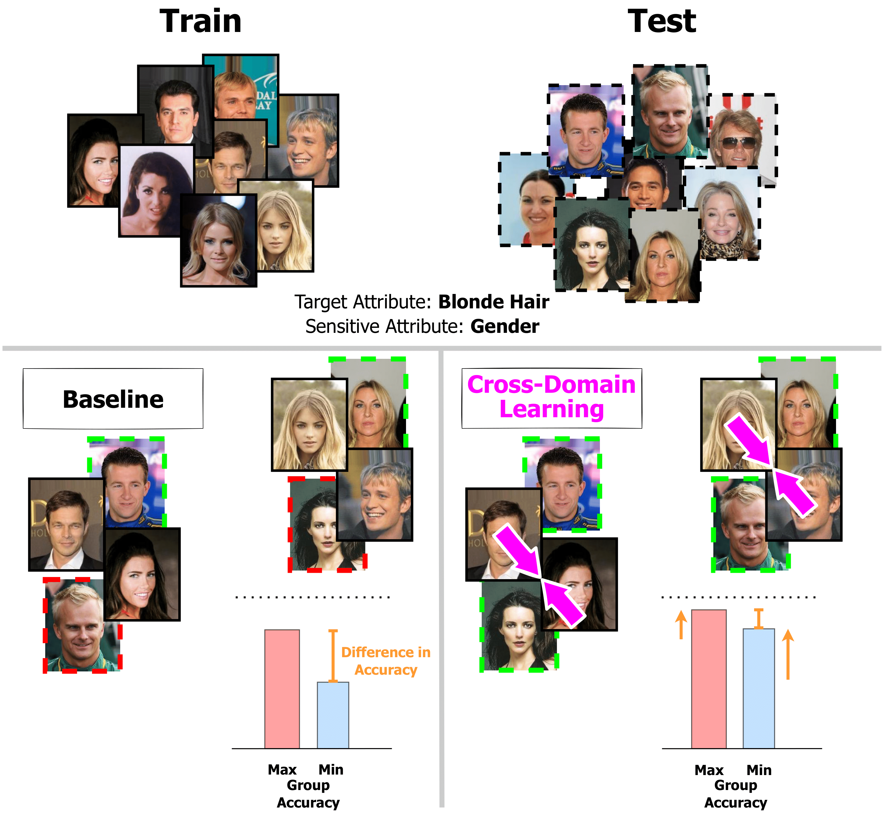

# Fairness meets Cross-Domain Learning: a new perspective on Models and Metrics

Official code of our work "Fairness meets Cross-Domain Learning: a new perspective on Models and Metrics"

<p align="center"></p>

## Introduction
<i>Deep learning-based recognition systems are deployed at scale for several real-world applications that inevitably involve our social life. Although being of great support when making complex decisions, they might capture spurious data correlations and leverage sensitive attributes (e.g. age, gender, ethnicity). How to factor out this information while keeping a high prediction performance is a task with still several open questions, many of which are shared with those of the domain adaptation and generalization literature which focuses on avoiding visual domain biases. In this work, we propose an in-depth study of the relationship between cross-domain learning (CD) and model fairness by introducing a benchmark on face and medical images spanning several demographic groups as well as classification and localization tasks. After having highlighted the limits of the current evaluation metrics, we introduce a new </i>Harmonic Fairness (HF)<i> score to assess jointly how fair and accurate every model is with respect to a reference baseline. Our study covers 14 CD approaches alongside three state-of-the-art fairness algorithms and shows how the former can outperform the latter. Overall, our work paves the way for a more systematic analysis of fairness problems in computer vision.</i>

# Setting up the environment
### Requirements
Make sure to have a CUDA capable device, running at learst CUDA 11.3. Throughout our experiments we used Python version 3.7.6

### General Dependencies
To install all the required dependencies go to the root folder of this project and run:
```bash
pip install -r requirements.txt
```

## Classification Datasets
### CelebA
1. Download and extract the CelebA "Align&Cropped Images" dataset and the Attributes Annotations from https://mmlab.ie.cuhk.edu.hk/projects/CelebA.html
2. Place `image_align_celeba` folder, `list_attr_celeba.txt` and `list_eval_partition.txt` inside the `data/celeba` folder.

### COVID-19 Chest X-Ray
1. Download the COVID-19 Chest X-Ray dataset from https://github.com/ieee8023/covid-chestxray-dataset
2. Place the decompressed `covid-chestxray-dataset` folder inside the `data` folder.

### Fitzpatrick17k
1. Download `fitzpatrick17k.csv` from https://github.com/mattgroh/fitzpatrick17k and follow their instructions to download the images of the Fitzpatrick17k dataset.
2. Place `fitzpatrick17k.csv` in the `data/fitzpatrick17k` folder.
3. Place the downloaded images inside the `data/fitzpatrick17k/images` folder.

## Landmark Detection Datasets
### UTKFace
1. Download the UTKFace "Aligned&Cropped Faces" dataset and the Landmarks Annotations from https://susanqq.github.io/UTKFace/
2. Place all the images from `UTKFace/align` folder inside the `data/UTKFace` folder.

# Experiments
Once you've correctly setup the datasets and the environment you can start running the experiments:
```bash
python main.py [--arguments...]
```
To view the general list of arguments, please refer to `parse_args.py`. Moreover, each specific metric, dataset and experiment, may have its own separate list of additional arguments which can be found in their respective `.py` file in the codebase.

Full examples on how to run the experiments can be found in the `scripts` folder. 

# Contributing
In order to contribute with your own task, dataset, metric or experiment, follow the provided codebase folder structure. Fork this repository and send a pull request.

### Adding a Task
To add a new computer vision task, follow the folder structure and make a new folder (with the name of the task) inside the `datasets`, `experiments`, `metrics` and `models` folders.
Specifically, inside the `datasets/<new-task-name>` folder create two files:
- `base_datasets.py` : containing the Dataset objects inheriting from `torch.utils.data.Dataset`
- `base_transforms.py` : containing the classes from which the `build_transform(args)` function gets called (refer to the already provided examples)

### Adding a Dataset
To add a new dataset, make a new folder with the name of the dataset inside the `datasets/<task-name>` folder. Then, create a file named `build.py` inside that folder (file structure example: `datasets/<task-name>/<dataset-name>/build.py`).
The `build.py` file contains two functions:
- `build_splits(args)` : is responsible for reading and separating the data into splits. This function shall return a python dict (each value of the dict is a list containing the examples for each split)
- [ Optional ] `additional_arguments(parser)` : is responsible for parsing additional arguments related to the dataset itself.

If you need a custom Dataset object or a custom Transform (other than those already provided) refer to the `base_datasets.py` and `base_transforms.py` files, respectively.

### Adding a Metric
To add a new dataset, make a new file or edit the already present file named `meters.py` inside the `metrics/<task-name>` folder.
Add your code inside `meters.py` file. Each Metric is an object in the form:
```python
class NewMetricName:

    def __init__(self, args, meters_dict):
        self.args = args
        self.meters_dict = meters_dict
        # Value of the metric is stored and accessed via self.value
        self.value = None

    def compute(self, predicted, target, group):
        # Perform calculation of the metric
        self.value = ...
        return self.value

    @staticmethod
    def additional_arguments(parser):
        # If you need additional metric-specific arguments
        parser.add_argument(...)
    
    @staticmethod
    def compare(current, best):
        return current > best # Example usage
```

### Adding an Experiment
To add a new dataset, make a new folder with the name of the method (containing a file named `experiment.py`) inside the `experiments/<task-name>` folder. (eg. `experiments/<task-name>/<method-name>/experiment.py`)
Add your code inside `experiment.py` file. Each Experiment is an object in the form:
```python
# NOTE: the name of the class MUST BE 'Experiment'
class Experiment:
    # How datasets/dataloaders shall be configured for this experiment (you can add additional entries inside this dict)
    # NOTE: 'train', 'val', 'test' are reserved keys used by the main training/validation/testing loops, respectively.
    data_config = {
        'train': {'dataset': 'BaseDataset', 'set': 'train_set', 'transform': 'BaseTrainTransform', 'filter': None, 'shuffle': True,  'drop_last': False},
        'val':   {'dataset': 'BaseDataset', 'set': 'val_set',   'transform': 'BaseTestTransform',  'filter': None, 'shuffle': False, 'drop_last': False},
        'test':  {'dataset': 'BaseDataset', 'set': 'test_set',  'transform': 'BaseTestTransform',  'filter': None, 'shuffle': False, 'drop_last': False},
        ...
    }

    @staticmethod
    def additional_arguments(parser):
        # If you need additional experiment-specific arguments
        parser.add_argument('--additional-argument-1', ...)
        parser.add_argument('--additional-argument-2', ...)
        ...
        # If you want to auto-set the output path according also to the values of each additional argument
        # you can return a list with the names of the names of the arguments to be logged. (otherwise return
        # an empty list)
        return ['additional-argument-1', 'additional-argument-2']

    def __init__(self, args, dataloaders):
        self.args = args
        self.dataloaders = dataloaders
        
        # NOTE: Each Experiment object MUST contain these two attributes
        self.iteration = 0
        self.best_metric = None

        # Model setup
        self.model = ...

        # Optimizers and Schedulers setup
        ...

    def save(self, path):
        # Save a checkpoint for the experiment (called at the end of each validation, will save both the best and last checkpoints)
        torch.save({
            'model': self.model.state_dict(),
            'iteration': self.iteration,
            'best_metric': self.best_metric,
            ...
        }, path)

    def load(self, path):
        # Restore a checkpoint (called before training if the run already exists and before testing to load the best checkpoint found)
        checkpoint = torch.load(path)
        self.model.load_state_dict(checkpoint['model'])
        self.iteration = checkpoint['iteration']
        self.best_metric = checkpoint['best_metric']
        ...

    def train_iteration(self, data):
        # Called at each training iteration

        # Unpack data based on which Dataset object you decided to use
        x, y, g = data
        ...

        # Run your loss calculation + update
        loss = ...

        self.optimizer.zero_grad()
        loss.backward()
        self.optimizer.step()

        # Return a dict containing anything you want to log
        return {'loss': loss.item()}

    @torch.no_grad()
    def evaluate(self, loader):
        # Called at validation-time and test-time
        self.model.eval()

        predicted = []
        target = []
        group = []

        cls_loss = 0

        for x, y, g in loader:
            x, y, g = x.to(DEVICE), y.to(DEVICE), g.to(DEVICE)

            _, pred = self.model(x)

            cls_loss += F.cross_entropy(pred, y).item()

            predicted.append(pred)
            target.append(y)
            group.append(g)
        
        predicted = torch.cat(predicted)
        target = torch.cat(target)
        group = torch.cat(group)

        self.model.train()
        
        # Return 3 torch.tensors to compute metrics + all validation losses to be logged
        return predicted, target, group, {'classification_loss': cls_loss / predicted.size(0)}
```

NOTE: additional models shall go inside the `models/<task-name>` folder

# Citation
```
@article{iurada2023fairness,
      title={Fairness meets Cross-Domain Learning: a new perspective on Models and Metrics}, 
      author={Leonardo Iurada and Silvia Bucci and Timothy M. Hospedales and Tatiana Tommasi},
      journal={arXiv preprint arXiv:2303.14411},
      year={2023}
}
```
